# 🏢 AI-Powered Data Centre EPC Intelligence Platform

### One Unified Dataset • Five AI Modules • One Intelligent Dashboard

An end-to-end AI platform that assists EPC teams throughout the lifecycle of a hyperscale data centre project by combining document intelligence, compliance verification, schedule forecasting, supply chain monitoring, and commissioning quality assurance into a single Streamlit application.

## 1. The Problem

India's data centre capacity is projected to scale from **~900 MW to 2,700+ MW by 2027**, but **67% of EPC projects run over schedule** — not because the engineering is hard, but because the *information* is scattered. A single project generates:

- Technical specs and design requirements from the client
- Vendor datasheets, quotations, and manuals
- Engineering drawings across electrical, mechanical, HVAC, and floor plans
- RFIs, meeting minutes, inspection sign-offs
- A Primavera-style master schedule that keeps slipping
- Multi-tier supply chain and shipment telemetry
- Commissioning reports and real-time sensor streams
- Hundreds of site inspection photos

None of it talks to each other. A generator shipment delay sitting in a logistics spreadsheet has no automatic link to the critical-path activity it's about to blow through. A vendor's UPS efficiency number in a 40-page PDF submittal never gets checked against the client's spec until someone manually does it, usually too late.

**CortexEPC unifies all of it under one relational backbone — `Project_ID`, `Equipment_ID`, `Vendor_ID`, `Activity_ID` — and layers AI on top to answer, predict, and recommend, instead of just storing.**

---

## 2. What's Built

All five AI modules are fully implemented and integrated into a single Streamlit dashboard.

| Module | Status | Description |
|---------|--------|-------------|
| 🤖 AI Project Knowledge Assistant | ✅ Complete | RAG-powered document assistant using Gemini + ChromaDB |
| 📋 AI Compliance Checker | ✅ Complete | Automatically verifies vendor documents against client requirements and generates compliance reports |
| 📅 AI Schedule Risk Predictor | ✅ Complete | Predicts cascading schedule delays, calculates risk scores, and recommends recovery actions |
| 🚚 AI Supply Chain Tracker | ✅ Complete | Tracks procurement status, shipment delays, vendor risks, and alternate suppliers |
| 🧪 AI Commissioning QA Copilot | ✅ Complete | Performs sensor anomaly detection, defect detection using YOLO, and generates commissioning reports |

## 3. Architecture

```mermaid
flowchart TD
    subgraph DATA["project_data/"]
        D1["01_Client_Documents"]
        D2["02_Vendor_Documents<br/>vendor_equipment_map.csv<br/>Datasheets · Quotations"]
        D3["03_Engineering_Drawings"]
        D4["04_RFIs_Meeting_Minutes"]
        D5["05_Inspection_Reports"]
        D6["06_Project_Schedule<br/>master_baseline_schedule.csv<br/>active_working_schedule.csv"]
        D7["07_Supply_Chain_Data<br/>Equipment_List · Vendor_Details<br/>Shipment_Status"]
        D8["08_Commissioning_Reports"]
        D9A["09_Compliance_Knowledge_Base<br/>requirements_register.csv<br/>remediation_kb.csv · ground_truth.csv"]
        D9B["09_Equipment_Images<br/>Defect_Samples/"]
        D10["10_Sensor_Readings"]
    end

    subgraph M1["Module 1 — RAG Knowledge Assistant"]
        M1a["build_rag_database.py<br/>chunk + embed all docs"]
        M1b[("ChromaDB<br/>project_corpus collection")]
        M1c["assistant.py<br/>Gemini + retrieval chat"]
        M1a --> M1b --> M1c
    end

    subgraph M2["Module 2 — Compliance Checker"]
        M2a["compliance_checker.py<br/>extract + classify vs requirements"]
        M2b["compliance_report.csv"]
        M2c["_eval_metrics.csv<br/>_confusion_matrix.csv"]
        M2a --> M2b
        M2a --> M2c
    end

    subgraph M3["Module 3 — Schedule Risk Predictor"]
        M3a["schedule_risk_predictor.py<br/>cascade delay + risk engine"]
        M3b["schedule_dashboard.html / .json"]
        M3a --> M3b
    end

    subgraph M4["Module 4 — Supply Chain Tracker"]
        M4a["supply_chain_tracker.py<br/>delay detection + alt-supplier recs"]
        M4b["supply_chain_dashboard.html / .json"]
        M4a --> M4b
    end

    subgraph M5["Module 5 — Commissioning QA Copilot"]
        M5a["config.py<br/>paths + safe limits"]
        M5b["sensor_analyzer.py<br/>voltage/current/temp thresholds"]
        M5c["YOLO vision<br/>yolov8n.pt defect detection"]
        M5d["helpers.py<br/>calculate_risk_score()"]
        M5e["Sensor + defect<br/>risk report"]
        M5a --> M5b
        M5a --> M5c
        M5b --> M5d
        M5c --> M5d
        M5d --> M5e
    end

    D1 --> M1a
    D2 --> M1a
    D3 --> M1a
    D4 --> M1a
    D5 --> M1a
    D6 --> M1a
    D7 --> M1a
    D8 --> M1a
    D10 --> M1a

    D9A --> M2a
    D2 --> M2a

    D6 --> M3a
    D7 --> M3a

    D7 --> M4a
    D6 --> M4a
    D2 -.optional.-> M4a

    D9B --> M5a
    D10 --> M5a
```



---

## 4. Module Deep-Dive

### 💬 Module 1 — AI Project Knowledge Assistant
`build_rag_database.py` + `assistant.py`

*   **Ingestion Pipeline:** Walks the full `project_data/` tree, extracts text from every PDF (utilizing an **automatic OCR fallback** via Tesseract for scanned documents), and converts every CSV row into a natural-language sentence so tabular data becomes fully searchable alongside prose.
*   **Vector Storage & Tagging:** Chunks and embeds data into a local, persistent **ChromaDB** collection using the `all-MiniLM-L6-v2` sentence-transformer. Each chunk inherits rich metadata (`source`, `doc_category`, `discipline`, `equipment_id`) directly from its source folder to power targeted, scoped queries (e.g., filtering strictly by category rather than relying on keyword luck).
*   **Equipment-Aware Retrieval:** Automatically detects known `Equipment_IDs` (e.g., `EQ-GEN-303`) within queries, biasing retrieval toward matching chunks first and backfilling with general semantic search to prevent minor mentions elsewhere from diluting relevant asset context.
*   **Generation & Grounding:** Powered by **Google Gemini** (`gemini-3.5-flash` via the unified `google-genai` SDK) under a strict system prompt requiring strict source-file citations, explicit flagging of numeric conflicts (e.g., client specs vs. vendor test results), and honest fallback handling for unsupported queries.
*   **State Management & Utilities:** Handles conversation continuity server-side via the Interactions API (`previous_interaction_id`) to eliminate manual prompt re-stitching, and includes a bonus `summarize <filename>` command for rapid 4–6 bullet document digests.

---

### ⚖️ Module 2 — AI Compliance Checker *(Data-Ready)*
`fill_data.py` has generated the foundational ground truth dataset for this module:
*   **`requirements_register.csv`:** Contains 13 client requirements across critical infrastructure components (UPS, Chiller, Generator, Battery, CRAH), complete with computed `Risk_Scores` derived from Criticality × Impact × Probability.
*   **`remediation_knowledge_base.csv`:** Maps known failure modes directly to suggested corrective actions.
*   **`compliance_ground_truth.csv`:** Provides explicit classification verdicts (Compliant, Non-Compliant, Partial Compliance, Missing Information) accompanied by client versus vendor values and rationales for every requirement.
*   *Next Steps:* Implementation of the automated OCR/NLP comparison engine to transition this architecture into a live compliance checker.

---

### 📅 Module 3 — AI Schedule Risk Predictor
`schedule_risk_predictor.py`

*   **Schedule Differencing:** Compares baseline schedules against active working schedules to instantly flag duration or float slips.
*   **Cascade Propagation:** Calculates total delay per activity as direct shipment delays plus inherited delays, propagated through a declared `{activity: [predecessors]}` dependency graph via **Kahn's-algorithm topological sort** (ensuring cyclic dependency maps fail safely at load time rather than corrupting forecasts).
*   **Impact Metrics:** Computes `Downstream_Blast_Radius` (measuring downstream vulnerability to further slip) alongside critical-path membership verification.
*   **Scoring & Prescriptive Actions:** Aggregates delays, remaining float, and vendor risk into a **0–10 composite risk score** (categorized into HIGH/MEDIUM/LOW bands) to drive context-aware recovery strategies—such as crashing schedules, fast-tracking prep work, or engaging dual-source vendors based on failure modes.
*   **Export Formats:** Outputs self-contained HTML dashboards (`saple_schedule_dashboard.html`) alongside raw JSON payloads for integration with downstream systems.

---

### 🚚 Module 4 — AI Supply Chain Tracker
`supply_chain_tracker.py`

*   **Shipment Monitoring:** Tracks equipment status against vendor timelines, transit states, and origin hubs.
*   **Float-Aware Delay Detection:** Evaluates delays contextually rather than against flat thresholds (e.g., a 2-day delay on an activity with 8 days of float is categorized as non-critical, whereas the same delay with 0 float triggers a live schedule breach). Categorizes statuses into four clear bands: `ON_TIME`, `DELAYED - WITHIN FLOAT`, `AT_RISK - FLOAT NEARLY EXHAUSTED`, and `CRITICAL_DELAY - SCHEDULE BREACH`.
*   **Risk Scoring:** Evaluates shipment health using a 0–10 composite scale blending vendor risk tiers with float exhaustion metrics.
*   **Smart Vendor Recommendations:** Suggests alternate suppliers from curated, category-specific vendor pools (excluding active vendors) ranked by risk tier alongside plain-language rationales.
*   **Export Formats:** Generates dual HTML dashboard and raw JSON data outputs.

---

### 🧪 Module 5 — AI Commissioning QA Copilot *(Data-Ready)*
`fill_images.py` has established a fully labelled synthetic dataset for quality assurance workflows:
*   **Reference Imagery:** Curated real equipment reference photos for Generator, UPS, Cooling System, Battery Storage, and CRAH units, featuring automated fallback handling to prevent dataset gaps.
*   **Synthetic Defect Generation:** Simulates structural and operational defects—including scorch marks, corrosion, exposed wiring, and panel cracks—mapped with precise bounding coordinates.
*   **Annotation Ground Truth:** Provides `image_annotations.csv` containing complete metadata (`Equipment_ID`, `Is_Defect`, `Defect_Class`, `BBox_X/Y/W/H`) optimized for training or evaluating YOLOv8 defect-detection models.

---

| Core LLM Engine | Integration Source |
| :--- | :--- |
| **Google Gemini (`gemini-3.5-flash`)** | Powered via the unified `google-genai` SDK |

## 5. Tech Stack

| Layer | Technologies |
|--------|--------------|
| Frontend | Streamlit |
| Backend | Python |
| LLM | Google Gemini 2.5 Flash |
| Vector Database | ChromaDB |
| Embeddings | all-MiniLM-L6-v2 |
| OCR | Tesseract OCR + pdf2image |
| Computer Vision | YOLOv8 |
| NLP | Sentence Transformers |
| Data Processing | Pandas, NumPy |
| Image Processing | Pillow, OpenCV |
| ML Framework | Scikit-learn |
| Document Parsing | PyPDF, PyMuPDF |
| Environment | python-dotenv |
| Testing | pytest |


# 6. Quickstart

## Prerequisites

- Python 3.10+
- Tesseract OCR
- Poppler
- Gemini API Key

---

## Installation

```bash
git clone <repository-url>

cd AI-DataCenter-EPC-Assistant

python -m venv venv

# Windows
venv\Scripts\activate

pip install -r requirements.txt
```

---

## Configure Environment

Create a `.env` file in the project root.

```env
GEMINI_API_KEY=YOUR_API_KEY
```

---

## Generate Project Dataset (Run Once)

```bash
python fill_data.py

python fill_images.py
```

---

## Build Vector Database (Run Once)

```bash
python AI_Assistant/build_rag_database.py
```

---

## Run Backend Modules

Before launching Streamlit, execute:

```bash
python Compliance_Checker/compliance_checker.py

python Schedule_Risk_Prediction/schedule_risk_prediction.py

python Supply_Chain_Tracker/supply_chain_tracker.py

python Quality_Assurance/sensors/sensor_analyzer.py

python Quality_Assurance/vision/detect_defect.py

python Quality_Assurance/reports/report_generator.py
```

---

## Launch the Dashboard

```bash
streamlit run app.py
```

Open your browser and navigate to:

```
http://localhost:8501
```

The dashboard automatically integrates all five AI modules.

## 7. Roadmap

- [ ] One-click startup (run every backend service directly from Streamlit)
- [ ] Live Primavera/MS Project integration
- [ ] SAP & ERP procurement integration
- [ ] IoT streaming instead of static sensor CSVs
- [ ] BIM / Digital Twin integration
- [ ] Multi-agent collaboration between modules
- [ ] Role-based authentication
- [ ] Cloud deployment (AWS / Azure / GCP)
- [ ] Mobile application for field engineers
- [ ] Real-time project analytics dashboard

## 8. Why This Matters

Modern EPC projects generate thousands of documents, engineering drawings, procurement records, inspection reports, commissioning logs, and sensor readings. Managing these independently leads to schedule overruns, compliance failures, increased costs, and delayed project delivery.

CortexEPC transforms fragmented project information into a unified AI-powered decision support platform.

The platform enables project teams to:

- 🤖 Ask natural-language questions across the complete project knowledge base.
- 📋 Automatically verify vendor submissions against client specifications.
- 📅 Predict schedule delays before they impact project milestones.
- 🚚 Monitor procurement and logistics risks in real time.
- 🧪 Detect commissioning defects using computer vision and sensor analytics.

Unlike traditional dashboards, CortexEPC combines document intelligence, predictive analytics, computer vision, and engineering workflows into a single application.

Every recommendation remains transparent and explainable. AI responses include document citations, compliance decisions are backed by requirement comparisons, schedule forecasts show cascading delay calculations, and risk scores are generated using interpretable engineering models rather than opaque black-box predictions.

The result is a practical AI platform that helps EPC teams reduce delays, improve compliance, minimize project risks, and deliver hyperscale data centre projects more efficiently.


## 9. 📂 Project Structure

```text
AI-DataCenter-EPC-Assistant/
│
├── AI_Assistant/
│   ├── assistant.py
│   ├── build_rag_database.py
│   └── __init__.py
│
├── Compliance_Checker/
│   ├── compliance_checker.py
│   ├── compliance_report.csv
│   ├── compliance_report_complete.csv
│   ├── compliance_report_evaluation.csv
│   └── __init__.py
│
├── Schedule_Risk_Prediction/
│   ├── schedule_risk_prediction.py
│   ├── schedule_dashboard.py
│   ├── schedule_dashboard.html
│   └── __init__.py
│
├── Supply_Chain_Tracker/
│   ├── supply_chain_tracker.py
│   ├── supply_chain_dashboard.py
│   ├── supply_chain_dashboard.html
│   └── __init__.py
│
├── Quality_Assurance/
│   ├── reports/
│   │   ├── report_generator.py
│   │   └── __init__.py
│   │
│   ├── sensors/
│   │   ├── sensor_analyzer.py
│   │   └── __init__.py
│   │
│   ├── vision/
│   │   ├── detect_defect.py
│   │   ├── train_yolo.py
│   │   ├── prepare_dataset.py
│   │   ├── generate_defect_images.py
│   │   ├── best.pt
│   │   └── __init__.py
│   │
│   ├── utils/
│   │   ├── config.py
│   │   ├── helper.py
│   │   └── __init__.py
│   │
│   └── __init__.py
│
├── project_data/
│   ├── 01_Client_Documents/
│   ├── 02_Vendor_Documents/
│   ├── 03_Engineering_Drawings/
│   ├── 04_RFIs_Meeting_Minutes/
│   ├── 05_Inspection_Reports/
│   ├── 06_Project_Schedule/
│   ├── 07_Supply_Chain_Data/
│   ├── 08_Commissioning_Reports/
│   ├── 09_Compliance_Knowledge_Base/
│   ├── 10_Equipment_Images/
│   ├── 11_Sensor_Readings/
│   └── chroma_db/
│
├── reports/
│
├── fill_data.py
├── fill_images.py
├── app.py
├── requirements.txt
├── README.md
├── .env.example
├── .gitignore
└── LICENSE
```
